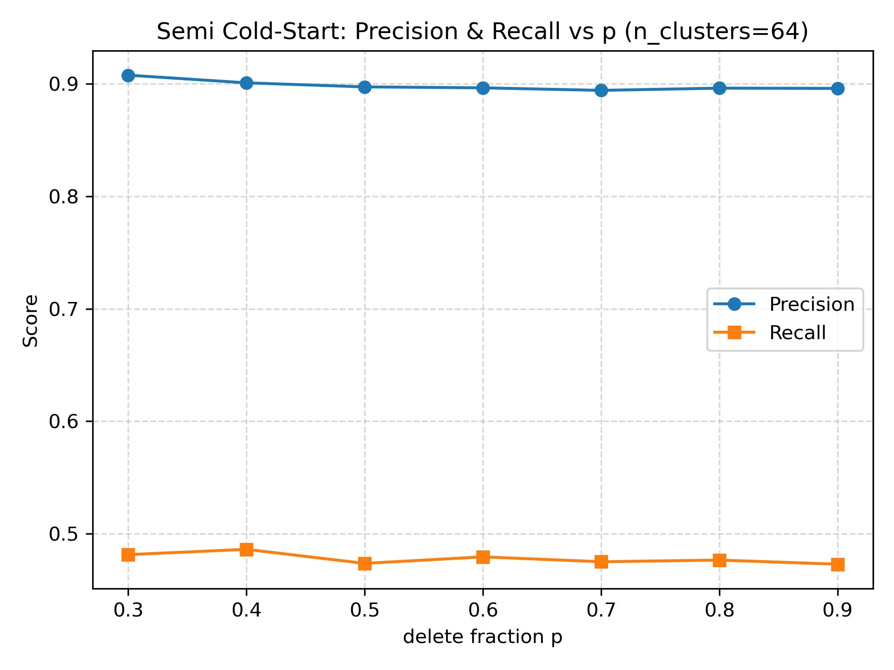

# 10701-final-project-cold-start-recommenders

## Evaluation Pipeline (`evaluate_dfp_coldstart.py`)

This script evaluates the Discriminant Frequent-Pattern (DFP) recommender under **pure cold-start** and **semi cold-start (in-matrix)** settings using **10-fold cross-validation**.  Evaluation is performed **only on deleted entries**, following the original DFP paper.

---

### 1. **Performs 10-fold user-level cross-validation**
Users are split into 10 folds to evaluate model generalization to unseen users.

---

### 2. **Builds Cold-Start Test Matrices**

### **Pure cold-start**
For each test user:
- All entries are deleted (set to NaN)
- Ground truth consists of all true positive items (value = 1)

### **Semi cold-start (in-matrix prediction)**  
For each user row and each fold:

- A delete fraction `p` is selected  
- Delete:
  - `p/2` of positive entries (value = 1)
  - `p/2` of negative entries (value = 0)
- The deleted cells form the **test set**

This is an exact reproduction of the deletion strategy in the paper.

---

### 3. **Runs DFP Prediction on Test Users**

For each fold:

1. Train DFP on `(UM_train, UP_train)`  
2. Predict missing entries for test users using cluster-specific discriminant itemsets  
3. Produce a completed matrix `UP_test_pred`

---

### 4. **Evaluates Precision, Recall, and F1 Only on Deleted Entries**

A test mask is built:

test_mask = (UP_test_input is NaN) & (UP_test_full not NaN)

Evaluation happens **only at these masked locations**:

- **TP**: predicted 1, true 1  
- **FP**: predicted 1, true 0  
- **FN**: predicted 0, true 1  

Metrics:

Precision = TP / (TP + FP)

Recall    = TP / (TP + FN)

F1        = 2PR / (P + R)

---

## Evaluation Results

All results below use n_clusters = 64, chosen from prior tuning, other 
parameters are the same as in paper.

---

## Pure Cold-Start (10-Fold CV)

| Metric | Mean | Std |
|--------|--------|---------|
| **Precision** | **0.8872** | 0.0139 |
| **Recall** | **0.4816** | 0.0257 |
| **F1** | **0.6239** | 0.0223 |

---

## Semi Cold-Start (Delete Fraction p = 0.3 → 0.9)

- **Precision remains stable** ~ 0.894–0.908  
- **Recall remains stable** ~ 0.473–0.486  
- **F1 remains stable** ~ 0.619–0.631  
- Little change across increasing p  
  because DFP predictions rely on **cluster-level discriminant patterns**,  
  not on the number of observed entries

A plot of Precision & Recall vs p is generated during evaluation.

---
